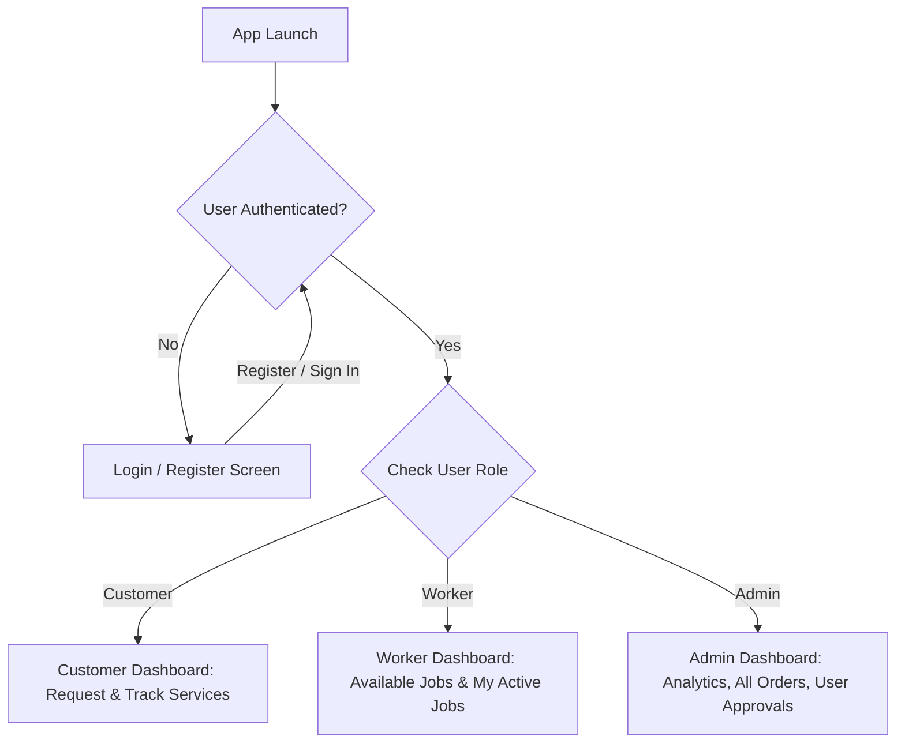

# Authentication & Role-Based Access Control (RBAC) Walkthrough

We have implemented Firebase Authentication and Role-Based Authorization in **LocalServe** with three distinct user roles: **Customer**, **Worker**, and **Admin**.

---

## 1. Architecture Summary



---

## 2. Key Components Created & Updated

### Data Models & Services
* [**`user_model.dart`**](file:///d:/CE%20sem%205/SDP/Project/SDP_PROJECT/SDP_PROJECT/localserve/lib/models/user_model.dart): Defines `AppUser` and `UserRole` (`customer`, `worker`, `admin`), supporting serialization and specialization fields.
* [**`service_request.dart`**](file:///d:/CE%20sem%205/SDP/Project/SDP_PROJECT/SDP_PROJECT/localserve/lib/models/service_request.dart): Added request lifecycle tracking (`pending`, `assigned`, `in_progress`, `completed`, `cancelled`), linking `customerId` and `workerId`.
* [**`auth_service.dart`**](file:///d:/CE%20sem%205/SDP/Project/SDP_PROJECT/SDP_PROJECT/localserve/lib/services/auth_service.dart): Reactive authentication service supporting Firebase Auth, real-time user session stream, and 1-click demo test accounts.
* [**`database_service.dart`**](file:///d:/CE%20sem%205/SDP/Project/SDP_PROJECT/SDP_PROJECT/localserve/lib/services/database_service.dart): Reactive Firestore query streams for each role and actions (accepting jobs, status transitions, approval toggles).

### Screens
* [**`auth_wrapper.dart`**](file:///d:/CE%20sem%205/SDP/Project/SDP_PROJECT/SDP_PROJECT/localserve/lib/screens/auth/auth_wrapper.dart): Gatekeeper directing users to their role-specific dashboard or login screen.
* [**`login_screen.dart`**](file:///d:/CE%20sem%205/SDP/Project/SDP_PROJECT/SDP_PROJECT/localserve/lib/screens/auth/login_screen.dart): Clean email/password login with input validation, register link, and 1-click test chips for each role.
* [**`register_screen.dart`**](file:///d:/CE%20sem%205/SDP/Project/SDP_PROJECT/SDP_PROJECT/localserve/lib/screens/auth/register_screen.dart): Form with role selection segmented control, worker specialization selection, and admin passcode verification (`admin123`).
* [**`home_screen.dart`**](file:///d:/CE%20sem%205/SDP/Project/SDP_PROJECT/SDP_PROJECT/localserve/lib/screens/home_screen.dart) *(Customer Dashboard)*: Displays logged-in customer info, live customer request stream, search & filter, new request form, and sign-out dialog.
* [**`worker_dashboard_screen.dart`**](file:///d:/CE%20sem%205/SDP/Project/SDP_PROJECT/SDP_PROJECT/localserve/lib/screens/worker/worker_dashboard_screen.dart): Dedicated Worker portal with tabs for *Available Jobs* (with "Accept Job" button) and *My Active Jobs* (with status controls).
* [**`admin_dashboard_screen.dart`**](file:///d:/CE%20sem%205/SDP/Project/SDP_PROJECT/SDP_PROJECT/localserve/lib/screens/admin/admin_dashboard_screen.dart): Administrator control center with KPI metric cards, all platform orders, and user directory with worker approval toggles.

### Security & Entry Point
* [**`firestore.rules`**](file:///d:/CE%20sem%205/SDP/Project/SDP_PROJECT/SDP_PROJECT/localserve/firestore.rules): Production-ready Cloud Firestore security rules enforcing RBAC permissions on the cloud database.
* [**`main.dart`**](file:///d:/CE%20sem%205/SDP/Project/SDP_PROJECT/SDP_PROJECT/localserve/lib/main.dart): Sets up providers and boots `AuthWrapper`.

---

## 3. Verification & Test Results

### Automated Tests
Ran `flutter test` across all role flows:
```
00:00 +0: LocalServe displays LoginScreen when unauthenticated
00:00 +1: 1-click Customer demo sign-in navigates to Customer Dashboard
00:01 +2: 1-click Worker demo sign-in navigates to Worker Dashboard
00:01 +3: 1-click Admin demo sign-in navigates to Admin Dashboard
00:01 +4: All tests passed!
```

### Static Analysis
Ran `flutter analyze`:
```
Analyzing localserve...
No issues found! (ran in 8.5s)
```

---

## 4. How to Test in the App

1. Launch the app (`flutter run`).
2. On the **Login Screen**:
   - Tap **"Customer Demo"** $\rightarrow$ Explore submitting, searching, and managing service requests.
   - Sign out via the top-right button $\rightarrow$ returned to Login.
   - Tap **"Worker Demo"** $\rightarrow$ View incoming open jobs under *Available Jobs*, click **"Accept Job"**, and update progress in *My Active Jobs*.
   - Sign out $\rightarrow$ Tap **"Admin Demo"** $\rightarrow$ View platform metrics, all service orders, and user list with worker approval toggles.
3. You can also test regular **Registration** with any email/password and choose Customer, Worker (with skill selection), or Admin (passcode: `admin123`).
