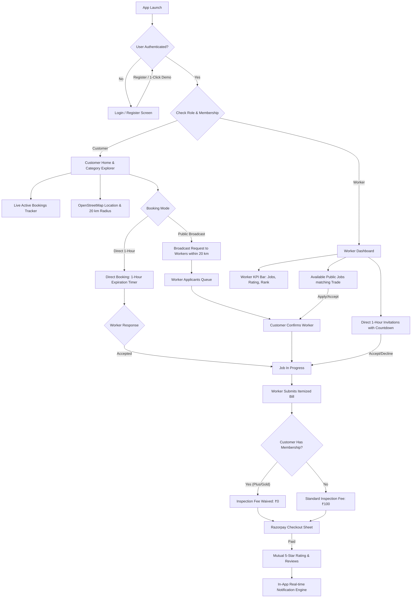

# 🛠️ LocalServe — Full System Architecture & Complete Walkthrough

**LocalServe** is a comprehensive, location-aware on-demand local home service booking application built with Flutter & Dart, supporting **Customers**, **Service Professionals (Workers)**, and **Verified PRO Members**.

---

## 1. System Architecture & Lifecycle Flow



---

## 2. Core Functional Modules

### 📍 A. OpenStreetMap & Real-Time Proximity Engine
- **GPS Auto-Detection**: Instant reverse geocoding via OpenStreetMap Nominatim.
- **Interactive Pin Dropper**: [LocationPickerScreen](file:///c:/SEM-V/PROJECTS/SDP_PROJECT/Flutter-application/SDP_PROJECT/localserve/lib/widgets/location_picker_screen.dart) allows customers and workers to pin their exact location on the map.
- **Geodesic Distance & Radius Enforcement**: Calculates distance using `latlong2`. Workers can only view and accept jobs within the **20 km maximum service radius**.

### ⚡ B. Dual Request & Booking Engine
1. **1-Hour Direct Worker Booking**: Customers can browse verified workers, check their past jobs and reviews, and send a direct request. The worker has exactly **1 hour** to accept or decline before automatic expiration.
2. **Public Broadcast Request**: Customers post an open service request broadcasted to all workers specializing in that trade within 20 km. Customers can inspect all applicants and confirm one with a single tap.

### 💳 C. Itemized Billing & Razorpay Integration
- Worker generates an itemized bill consisting of:
  - **Labor charge** (worker defined)
  - **Distance fee** (₹250 for $< 10$ km, ₹500 for $< 20$ km)
  - **Condition assessment fee** (₹100 standard inspection)
- [RazorpayPaymentSheet](file:///c:/SEM-V/PROJECTS/SDP_PROJECT/Flutter-application/SDP_PROJECT/localserve/lib/widgets/razorpay_payment_sheet.dart) simulates secure digital payment, receipt generation, and real-time order completion.

### 👑 D. Membership Ecosystem
- **Customer Tiers** (*LocalServe Plus & Gold VIP*):
  - Automatically waives the ₹100 inspection fee ($\rightarrow$ ₹0) on all bookings.
  - 10%–20% labor discounts and priority matching.
- **Worker Tiers** (*Worker Pro Club & Elite*):
  - Verified **`⭐ PRO`** badge in search and profiles.
  - **#1 Ranking** in category worker listings.
  - **0% platform service fee commission**.

---

## 3. Directory & File Map

| File | Purpose |
| :--- | :--- |
| [**`main.dart`**](file:///c:/SEM-V/PROJECTS/SDP_PROJECT/Flutter-application/SDP_PROJECT/localserve/lib/main.dart) | Design system, Royal Sapphire & Indigo theme, Provider injection, and app entry point. |
| [**`models/user_model.dart`**](file:///c:/SEM-V/PROJECTS/SDP_PROJECT/Flutter-application/SDP_PROJECT/localserve/lib/models/user_model.dart) | User entity with coordinates, membership status, ratings, and role getters. |
| [**`models/membership_model.dart`**](file:///c:/SEM-V/PROJECTS/SDP_PROJECT/Flutter-application/SDP_PROJECT/localserve/lib/models/membership_model.dart) | Plans definition for Customer Plus/Gold and Worker Pro/Elite tiers. |
| [**`models/service_request.dart`**](file:///c:/SEM-V/PROJECTS/SDP_PROJECT/Flutter-application/SDP_PROJECT/localserve/lib/models/service_request.dart) | Request state machine (`pending`, `assigned`, `in_progress`, `completed`, `cancelled`). |
| [**`services/auth_service.dart`**](file:///c:/SEM-V/PROJECTS/SDP_PROJECT/Flutter-application/SDP_PROJECT/localserve/lib/services/auth_service.dart) | Session management, 4-role demo users, and membership upgrades. |
| [**`services/database_service.dart`**](file:///c:/SEM-V/PROJECTS/SDP_PROJECT/Flutter-application/SDP_PROJECT/localserve/lib/services/database_service.dart) | Core business logic, 20 km distance checks, direct 1-hr expiration, and ranking. |
| [**`screens/home_screen.dart`**](file:///c:/SEM-V/PROJECTS/SDP_PROJECT/Flutter-application/SDP_PROJECT/localserve/lib/screens/home_screen.dart) | Customer home, Live Active Booking Tracker, categories grid, and Featured Pros. |
| [**`screens/membership_screen.dart`**](file:///c:/SEM-V/PROJECTS/SDP_PROJECT/Flutter-application/SDP_PROJECT/localserve/lib/screens/membership_screen.dart) | Full membership hub with comparison table and Razorpay upgrade modal. |
| [**`screens/worker/worker_dashboard_screen.dart`**](file:///c:/SEM-V/PROJECTS/SDP_PROJECT/Flutter-application/SDP_PROJECT/localserve/lib/screens/worker/worker_dashboard_screen.dart) | Worker portal with KPI performance bar, 1-hr direct invitations, and active jobs. |
| [**`screens/service_details_screen.dart`**](file:///c:/SEM-V/PROJECTS/SDP_PROJECT/Flutter-application/SDP_PROJECT/localserve/lib/screens/service_details_screen.dart) | Interactive 4-step progress stepper, OpenStreetMap route preview, and payment sheet. |

---

## 4. Verification & Test Suite

### Automated Test Execution
Run the full test suite via terminal:
```bash
flutter test
```

**Results: 32 / 32 Tests Passing (100% Pass Rate)**
- `test/membership_test.dart`: Membership getters, PRO worker ranking, and inspection fee waiving.
- `test/location_map_test.dart`: Nominatim geocoding, 20 km distance filtering, direct 1-hr expiry, and Razorpay billing.
- `test/widget_test.dart`: UI rendering, 1-click role logins, customer request creation, and worker dashboard routing.

### Static Analysis
```bash
flutter analyze
```
**Result: No issues found! (0 errors, 0 warnings).**

---

## 5. Quick Test & Demonstration Guide

1. Start the app:
   ```bash
   flutter run
   ```
2. On the **Login Screen**, use the **Quick Test Sign-In** chips:
   - **Customer Demo** (*John Customer*): Create requests, track live bookings, pick location on OpenStreetMap.
   - **Plus Customer Demo** (*Priya Patel*): Test ₹0 inspection fee perk and Plus VIP badge.
   - **Worker Demo** (*Alex Plumber*): Manage available requests, accept direct 1-hour jobs, submit itemized bills.
   - **PRO Worker Demo** (*Vikram Singh*): Experience Verified PRO badge, #1 ranking, and KPI summary bar.
